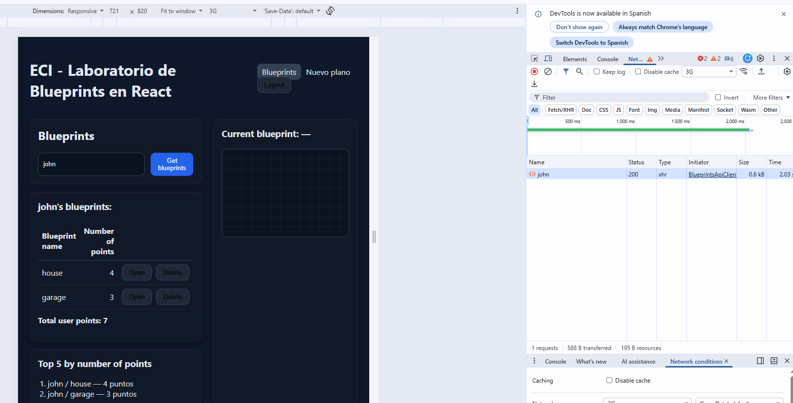
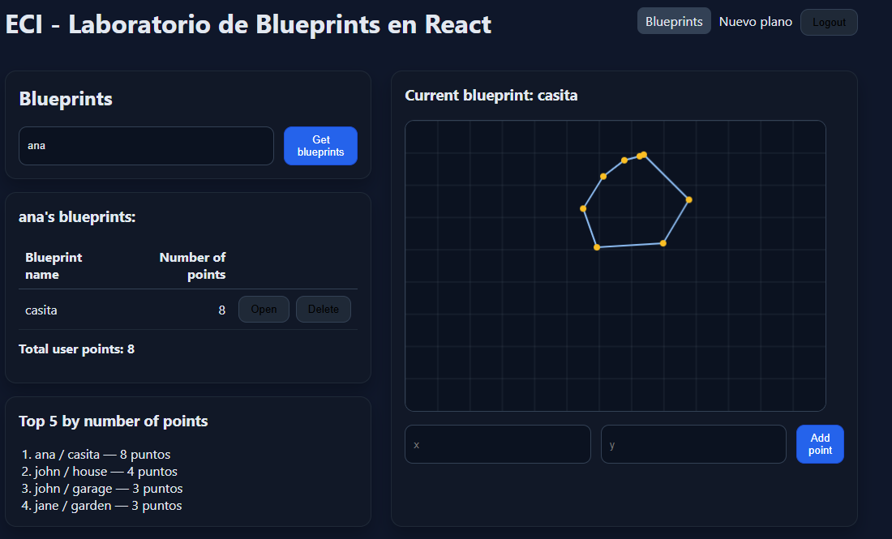
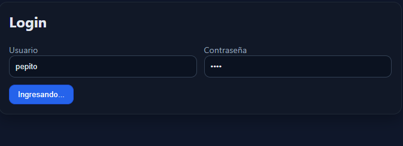
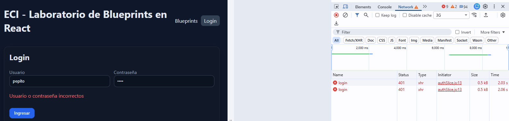
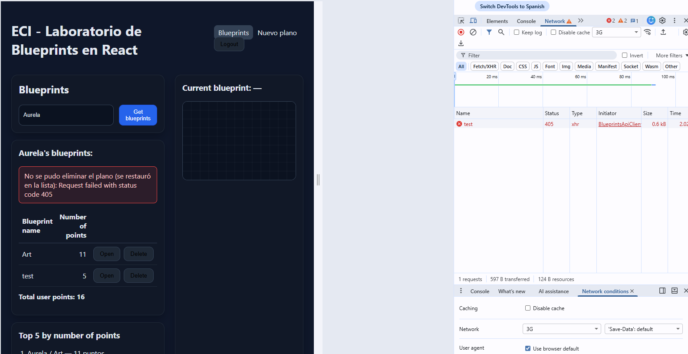
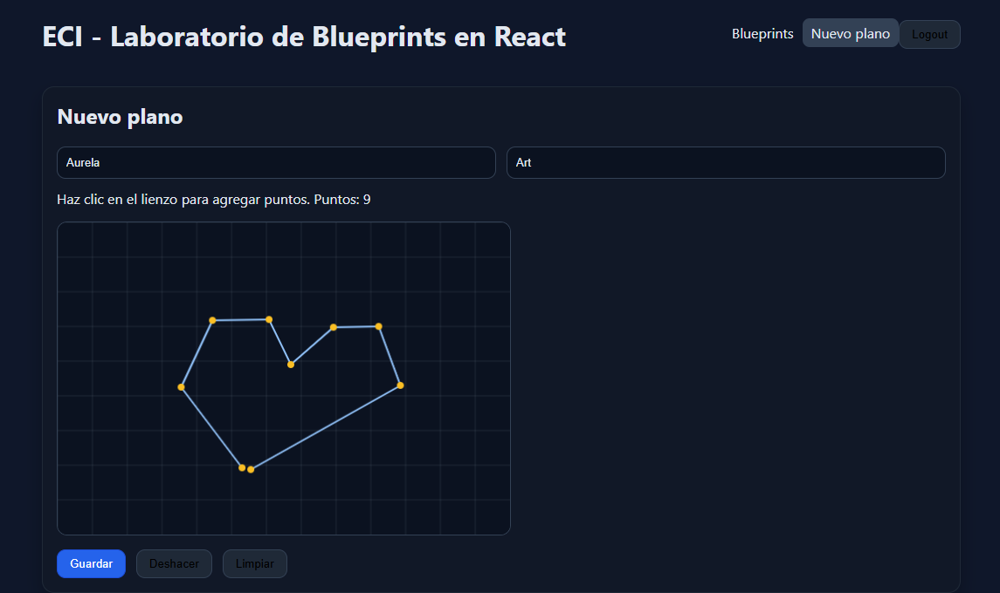
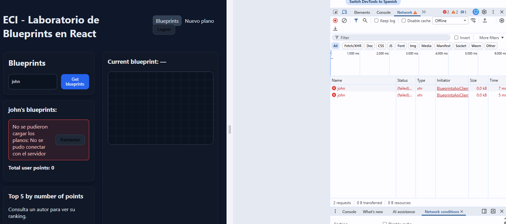

# Lab – React Client for Blueprints (Redux + Axios + JWT)

> Basado en el cliente HTML/JS del repo de referencia, este laboratorio moderniza el _frontend_ con **React + Vite**, **Redux Toolkit**, **Axios** (con interceptores y JWT), **React Router** y pruebas con **Vitest + Testing Library**.

## Objetivos de aprendizaje

- Diseñar una SPA en React aplicando **componetización** y **Redux (reducers/slices)**.
- Consumir APIs REST de Blueprints con **Axios** y manejar **estados de carga/errores**.
- Integrar **autenticación JWT** con interceptores y rutas protegidas.
- Aplicar buenas prácticas: estructura de carpetas, `.env`, linters, testing, CI.

## Requisitos previos

- Tener corriendo el backend de Blueprints de los **Labs 3 y 4** (APIs + seguridad).
- Node.js 18+ y npm.

Ver la especificación de glosario clave, consulta las [Definiciones del laboratorio](./DEFINICIONES.md).

## Endpoints esperados (ajústalos si tu backend quedo diferente)

- `GET /api/blueprints` → lista general o catálogo para derivar autores.
- `GET /api/blueprints/{author}`
- `GET /api/blueprints/{author}/{name}`
- `POST /api/blueprints` (requiere JWT)
- `POST /api/auth/login` → `{ token }`

Configura la URL base en `.env`.

## Cómo arrancar

```bash
npm install
cp .env.example .env
# edita .env con la URL del backend
npm run dev
```

Abre `http://localhost:5173`

## Variables de entorno

Crea un archivo `.env` en la raíz:

```variable
VITE_API_BASE_URL=http://localhost:8080/api
```

> **Tip:** en producción usa variables seguras o un _reverse proxy_.

## Estructura

```carpetas
blueprints-react-lab/
├─ src/
│  ├─ components/
│  ├─ features/blueprints/blueprintsSlice.js
│  ├─ pages/
│  ├─ services/apiClient.js   # axios + interceptores JWT
│  ├─ store/index.js          # Redux Toolkit
│  ├─ App.jsx, main.jsx, styles.css
├─ tests/
├─ .github/workflows/ci.yml
├─ index.html, package.json, vite.config.js, README.md
```

## 📌 Requerimientos del laboratorio

## 1. Canvas (lienzo)

- Agregar un lienzo (Canvas) a la página.
- Incluir un componente `BlueprintCanvas` con un identificador propio.
- Definir dimensiones adecuadas (ej. `520×360`) para que no ocupe toda la pantalla pero permita dibujar los planos.

## 2. Listar los planos de un autor

- Permitir ingresar el nombre de un autor y consultar sus planos desde el backend (o mock).
- Mostrar los resultados en una tabla con las siguientes columnas:
  - Nombre del plano
  - Número de puntos
  - Botón `Open` para abrirlo

## 3. Seleccionar un plano y graficarlo

Al hacer clic en el botón `Open`, debe:

- Actualizar un campo de texto con el nombre del plano actual.
- Obtener los puntos del plano correspondiente.
- Dibujar consecutivamente los segmentos de recta en el canvas y marcar cada punto.

## 4. Servicios: `apimock` y `apiclient`

- Implementar dos servicios con la misma interfaz:
  - `apimock`: retorna datos de prueba desde memoria.
  - `apiclient`: consume el API REST real con Axios.
- La interfaz de ambos debe incluir los métodos:
  - `getAll`
  - `getByAuthor`
  - `getByAuthorAndName`
  - `create`
- Habilitar el cambio entre `apimock` y `apiclient` con una sola línea de código:
  - Definir un módulo `blueprintsService.js` que importe uno u otro según una variable en `.env`.
  - Ejemplo en `.env` (Vite):

```env
VITE_USE_MOCK=true
```

- `VITE_USE_MOCK=true` usa el mock.
- `VITE_USE_MOCK=false` usa el API real.

## 5. Interfaz con React

- El nombre del plano actual debe mostrarse en el DOM como parte del estado global (Redux).
- Evitar manipular directamente el DOM; usar componentes y props/estado.

## 6. Estilos

- Agregar estilos para mejorar la presentación.
- Se puede usar Bootstrap u otro framework CSS.
- Ajustar la tabla, botones y tarjetas para acercarse al mock de referencia.

## 7. Pruebas unitarias

- Agregar pruebas con Vitest + Testing Library para validar:
  - Render del canvas.
  - Envío de formularios.
  - Interacciones básicas con Redux (por ejemplo: dispatch de `fetchByAuthor`).

---

### Notas rápidas y recomendaciones

- Para el canvas en tests con jsdom: agregar un mock de `HTMLCanvasElement.prototype.getContext` en `tests/setup.js`.
- Para usar `@testing-library/jest-dom` con Vitest: en `tests/setup.js` importar `import '@testing-library/jest-dom'` y asegurarse de que Vitest provea el global `expect` (configurar `vitest.config.js` con la opción `test: { globals: true, setupFiles: './tests/setup.js' }`).
- Para la conmutación de servicios en Vite, usar `import.meta.env.VITE_USE_MOCK` para leer la variable en tiempo de ejecución.

## 📌 Recomendaciones y actividades sugeridas para el exito del laboratorio

1. **Redux avanzado**
   - [ ] Agrega estados `loading/error` por _thunk_ y muéstralos en la UI.
   - [ ] Implementa _memo selectors_ para derivar el top-5 de blueprints por cantidad de puntos.
2. **Rutas protegidas**
   - [ ] Crea un componente `<PrivateRoute>` y protege la creación/edición.
3. **CRUD completo**
   - [ ] Implementa `PUT /api/blueprints/{author}/{name}` y `DELETE ...` en el slice y en la UI.
   - [ ] Optimistic updates (revertir si falla).
4. **Dibujo interactivo**
   - [ ] Reemplaza el `svg` por un lienzo donde el usuario haga _click_ para agregar puntos.
   - [ ] Botón “Guardar” que envíe el blueprint.
5. **Errores y _Retry_**
   - [ ] Si `GET` falla, muestra un banner y un botón **Reintentar** que dispare el thunk.
6. **Testing**
   - [ ] Pruebas de `blueprintsSlice` (reducers puros).
   - [ ] Pruebas de componentes con Testing Library (render, interacción).
7. **CI/Lint/Format**
   - [ ] Activa **GitHub Actions** (workflow incluido) → lint + test + build.
8. **Docker (opcional)**
   - [ ] Crea `Dockerfile` (+ `compose`) para front + backend.

## Criterios de evaluación

- Funcionalidad y cobertura de casos (30%)
- Calidad de código y arquitectura (Redux, componentes, servicios) (25%)
- Manejo de estado, errores, UX (15%)
- Pruebas automatizadas (15%)
- Seguridad (JWT/Interceptores/Rutas protegidas) (10%)
- CI/Lint/Format (5%)

## Scripts

- `npm run dev` – servidor de desarrollo Vite
- `npm run build` – build de producción
- `npm run preview` – previsualizar build
- `npm run lint` – ESLint
- `npm run format` – Prettier
- `npm test` – Vitest

---

### Extensiones propuestas del reto

- **Redux Toolkit Query** para _caching_ de requests.
- **MSW** para _mocks_ sin backend.
- **Dark mode** y diseño responsive.

> Este proyecto es un punto de partida para que tus estudiantes evolucionen el cliente clásico de Blueprints a una SPA moderna con prácticas de la industria.


# Desarrollo del laboratorio 

Esta sección documenta las actividades sugeridas . El backend usado es el del
laboratorio anterior **que no fue modificado para este lab**.

## Configuración previa

El backend corre en `http://localhost:8080` y el frontend en `http://localhost:5173`.
Al ser orígenes distintos, el navegador bloqueaba las peticiones por CORS. Para no
modificar el backend se configuró un **proxy en el servidor de desarrollo de Vite**:

```js
// vite.config.js
server: {
  proxy: {
    '/api': 'http://localhost:8080',
    '/auth': 'http://localhost:8080',
  },
}
```

Así el frontend pide a su propio origen y Vite reenvía la petición al backend.

Variables de entorno (En la estructura vamos a ver tanto `.env.example` como `.env`, esto debido a que prefirimos dejar el que ya estaba y agregar el que necesitabamos, es decir `.env`):

```env
VITE_API_BASE_URL=/api
VITE_AUTH_BASE_URL=/auth
VITE_USE_MOCK=false
```


>Podemos ver que obtenemos un funcionamiento correcto.

## Requerimiento previo: servicios `apimock` y `apiclient`

Antes de los puntos 1–5 se completó el requerimiento 4 del laboratorio, necesario
para el resto del desarrollo. Se crearon tres módulos en `src/services/`:

| Archivo | Responsabilidad |
|---|---|
| `blueprintsApiClient.js` | Consume el API REST real con Axios |
| `blueprintsApiMock.js` | Devuelve datos de prueba desde memoria |
| `blueprintsService.js` | Selecciona uno u otro según `VITE_USE_MOCK` |

Ambas implementaciones exponen la **misma interfaz** (`getAll`, `getByAuthor`,
`getByAuthorAndName`, `create` y, desde el punto 3, `addPoint` y `remove`) y devuelven
datos planos, no respuestas de Axios. El cambio entre uno y otro se hace en una sola línea:

```js
const blueprintsService =
  import.meta.env.VITE_USE_MOCK === 'true' ? blueprintsApiMock : blueprintsApiClient
```

Los *thunks* del slice llaman al servicio y no conocen Axios ni las URLs, por lo que
cambiar de fuente de datos no requiere modificar Redux ni los componentes.

## 1. Redux avanzado

**Estados `loading`/`error` por thunk.** En lugar de un `status` global se usa un
objeto `requests`, con una entrada por operación:

```js
requests: {
  fetchAuthors:    { status: 'idle', error: null },
  fetchByAuthor:   { status: 'idle', error: null },
  fetchBlueprint:  { status: 'idle', error: null },
  createBlueprint: { status: 'idle', error: null },
}
```

Cada thunk actualiza solo su entrada en `pending` (`loading`), `fulfilled`
(`succeeded`) y `rejected` (`failed` con el mensaje). Esto evita que dos peticiones
simultáneas se pisen el estado: cargar la lista de un autor y abrir un plano muestran
su indicador de carga y su error de forma independiente.

**Selector memoizado del top-5.** `selectTopBlueprints` usa `createSelector` para
derivar los cinco planos con más puntos:

```js
export const selectTopBlueprints = createSelector([selectByAuthorState], (byAuthor) =>
  Object.values(byAuthor)
    .flat()
    .sort((a, b) => (b.points?.length || 0) - (a.points?.length || 0))
    .slice(0, 5),
)
```

`.flat()` crea un arreglo nuevo, de modo que `.sort()` no muta el estado de Redux. El
resultado se muestra en una tarjeta de la página principal y se recalcula solo cuando
cambia `byAuthor`.



## 2. Rutas protegidas

Se implementó la autenticación completa con JWT:

- **`features/auth/authSlice.js`**: guarda el token en Redux, con el thunk `login`
  (POST `/auth/login`, lee `access_token`) y la acción `logout`.
- **`components/PrivateRoute.jsx`**: si no hay token redirige a `/login` y guarda la
  ruta solicitada en `state.from`, para volver a ella después de iniciar sesión.
- **`services/apiClient.js`**: un interceptor de petición agrega
  `Authorization: Bearer <token>`; un interceptor de respuesta despacha `logout()`
  ante un **401**. No ante un 403, que significa sesión válida sin permiso suficiente.
- **`store/index.js`**: entrega al `apiClient` las funciones `getToken` y
  `onUnauthorized` mediante `configureApiClient`, evitando un *import* circular entre
  el store y el cliente HTTP. También sincroniza el token con `localStorage` para que
  la sesión sobreviva a una recarga.

Como el backend exige el scope `blueprints.read` en todas las rutas `/api/**`, se
protegieron la página principal, el detalle y la creación de planos.




## 3. CRUD completo con *optimistic updates*

**Operaciones nuevas.** A los servicios se agregaron `addPoint` (PUT
`/api/blueprints/{author}/{name}/points`) y `remove` (DELETE), y al slice los thunks
`addPoint` y `deleteBlueprint`. En la interfaz se añadieron un botón **Delete** por
fila y un formulario para agregar un punto al plano abierto.

**Actualización optimista.** El cambio se aplica en el estado antes de la respuesta
del servidor y se revierte si la petición falla:

| Momento | Acción |
|---|---|
| `pending` | Aplica el cambio y guarda una copia en `backups[requestId]` |
| `fulfilled` | Descarta la copia |
| `rejected` | Restaura desde la copia y registra el error |

Se usa `action.meta.arg` para conocer los argumentos del thunk durante `pending` y
`action.meta.requestId` como llave única, de modo que dos operaciones simultáneas no
mezclen sus copias. Al borrar, el plano se reinserta en su posición original
(`splice(index, 0, item)`); al agregar un punto, se elimina ese punto del plano.

**Limitación conocida.** El backend del laboratorio anterior **no expone `DELETE`**,
por lo que esa operación falla contra el API real y el estado se revierte. Esto
permite evidenciar el *rollback*; el flujo exitoso se demuestra con
`VITE_USE_MOCK=true`. El `PUT` disponible agrega un punto a un plano existente, por lo
que esa es la operación de actualización implementada.



## 4. Dibujo interactivo

**`BlueprintCanvas`** recibe ahora una propiedad opcional `onAddPoint`. Sin ella el
componente solo dibuja, como antes; con ella captura los clics y convierte la posición
del cursor a coordenadas del lienzo:

```js
const rect = canvas.getBoundingClientRect()
const scaleX = canvas.width / rect.width
x = Math.round((e.clientX - rect.left) * scaleX)
```

El escalado es necesario porque el CSS (`width: 100%`) puede mostrar el lienzo a un
tamaño distinto de sus 520×360 reales; sin él los puntos quedarían desplazados.

**`NewBlueprintPage`** (ruta protegida `/blueprints/new`) permite construir un plano
haciendo clic, con los botones **Guardar**, **Deshacer** y **Limpiar**. Los puntos del
borrador se mantienen en estado local (`useState`) porque son temporales de esa
pantalla; solo al guardar se despacha `createBlueprint` y el resultado pasa a Redux.
Guardar requiere autor, nombre y al menos dos puntos, y usa `.unwrap()` para
distinguir el éxito del error.


> Importante mencionar que para crear puntos debes estar logeado con la cuenta que tenga el scope necesario, en este caso es asssitant.
## 5. Errores y *Retry*

Se creó el componente reutilizable **`ErrorBanner`** (`role="alert"`), que muestra el
mensaje y, opcionalmente, un botón **Reintentar**. Reintentar consiste en volver a
despachar el mismo thunk con los mismos argumentos.

No todos los errores se reintentan. El slice marca cada fallo con `retryable` según el
código de Axios: errores de red, tiempo agotado y respuestas 5xx sí lo son; un 404 o un
403 fallaría igual, por lo que en esos casos el banner se muestra sin botón. Además,
el botón solo se ofrece en operaciones de lectura (GET): repetir un POST o un DELETE
podría duplicar o borrar datos. Los errores de las operaciones optimistas usan el
mismo banner sin botón, ya que el estado se revierte automáticamente.

